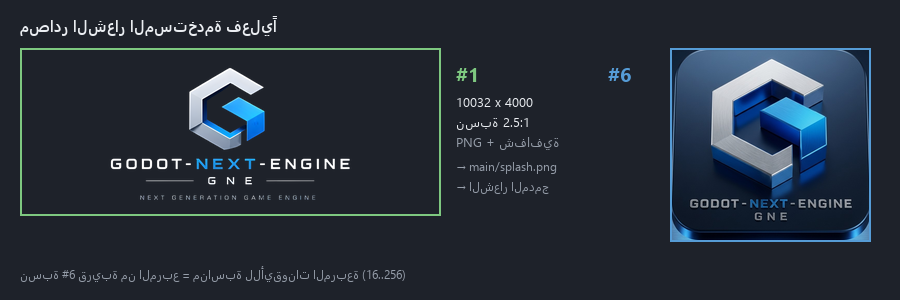
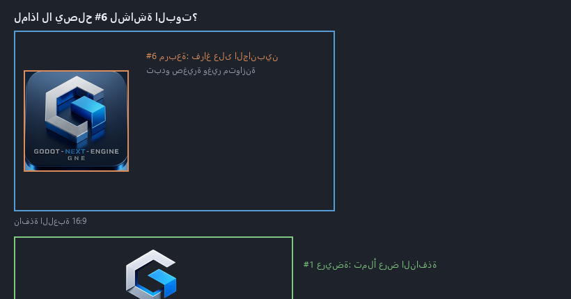
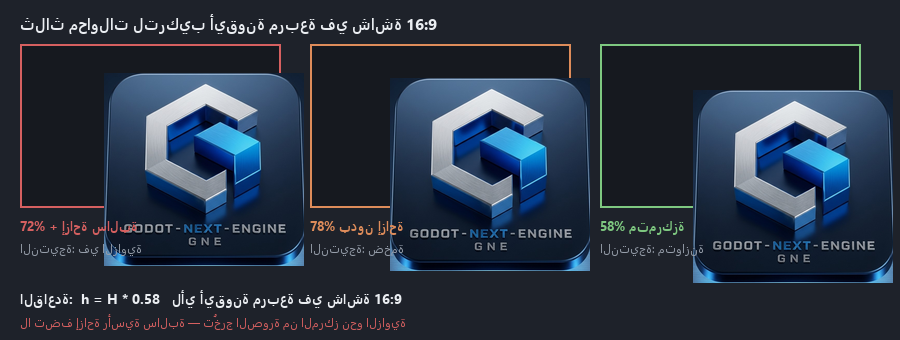
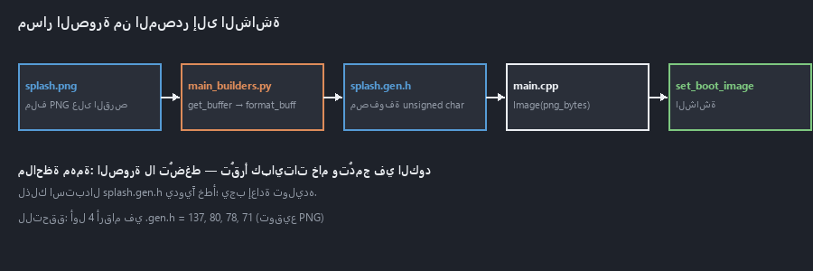
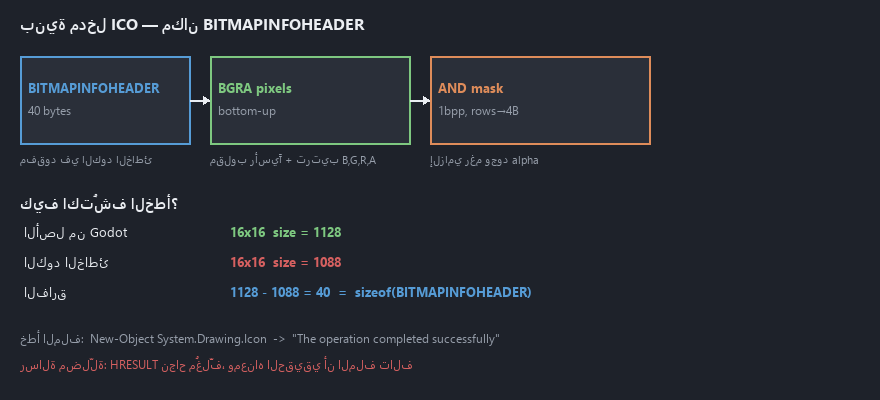

# GNE Branding Directive — استبدال هوية Godot بهوية GNE

> **الغرض من هذه الوثيقة:** إعطاء مدير المشروع الأصلي كل ما يلزم لإعادة تنفيذ
> عملية استبدال شعار واسم المحرك بهوية **GNE (Godot Next Engine)** بشكل
> صحيح ومكتمل، مع كل التفاصيل والأخطاء التي وُوجهت والحلول التي نجحت.
>
> **النسخة المنفَّذة:** Godot 4.8.dev / Vulkan / Windows x86_64 / MSVC 14.5
> **تاريخ التنفيذ:** 2026-09-28
> **الحالة:** ✅ مُختبَرة وناجحة (بناء + تشغيل + لقطات شاشة)

---

## فهرس الرسومات

| # | الصورة | توضيحة |
|---|--------|--------|
| 1 | [مصادر الشعار](figures/fig_sources.png) | الصورتان المستخدمتان فعليًا ونسبهما |
| 2 | [مشكلة النسبة](figures/fig_ratio.png) | لماذا أيقونة مربعة تفشل في شاشة 16:9 |
| 3 | [محاولات التركيب](figures/fig_layouts.png) | المحاولات الثلاث والنسبة الصحيحة 58% |
| 4 | [بنية ICO](figures/fig_ico_structure.png) | مكان `BITMAPINFOHEADER` وكيفية اكتشاف الخطأ |
| 5 | [مسار الصورة](figures/fig_pipeline.png) | من ملف PNG إلى بكسلات الشاشة |

> **لتوليد هذه الرسومات:** `python tools/make_directive_figures.py docs/figures`
> (يتطلب `pip install Pillow`)

---

## 0. ملخص تنفيذي

### 0.1 خريطة الطبقات الأربع

الهوية البصرية في Godot لا تُضبط من مكان واحد، بل من **أربع طبقات مستقلة**.
التعديل على طبقة واحدة لا يُغيّر الطبقات الأخرى:

```
┌─────────────────────────────────────────────────────────────┐
│  الطبقة 1 — المشروع                                         │
│  demo/gpu_smoke/project.godot  →  boot_splash/*             │
│  ◀ لا يحتاج بناء، فقط إعادة تشغيل                           │
└─────────────────────────────────────────────────────────────┘
                         ↓ عند غياب boot_splash/image
┌─────────────────────────────────────────────────────────────┐
│  الطبقة 2 — الشعار المدمج في المحرك                         │
│  main/splash.png  →  splash.gen.h  →  main.cpp              │
│  ◀ يحتاج بناء (≈ 2 دقيقة)                                   │
└─────────────────────────────────────────────────────────────┘
                         ↓ أيقونة الملف التنفيذي
┌─────────────────────────────────────────────────────────────┐
│  الطبقة 3 — موارد Windows                                   │
│  platform/windows/godot.ico  →  godot_res.rc  →  .exe       │
│  ◀ يحتاج بناء (≈ 41 ثانية)                                  │
└─────────────────────────────────────────────────────────────┘
┌─────────────────────────────────────────────────────────────┐
│  الطبقة 4 — بيانات الملف                                    │
│  godot_res.rc: ProductName / CompanyName / FileDescription  │
│  ◀ يحتاج بناء                                                │
└─────────────────────────────────────────────────────────────┘
```

| # | الطبقة | الهدف | يحتاج بناء؟ | زمن البناء |
|---|--------|-------|-------------|-----------|
| 1 | المشروع | شعار شاشة البوت داخل نافذة اللعبة | ❌ لا | فوري |
| 2 | المحرك | الشعار المدمج (للمحرّك + كل المشاريع) | ✅ نعم | 2:09 |
| 3 | المحرك | أيقونة `.exe` + النافذة + شريط المهام | ✅ نعم | 0:41 |
| 4 | المحرك | اسم المنتج في خصائص الملف | ✅ نعم | 0:41 |

**النتيجة النهائية:** الشعار الجديد يظهر في شاشة البوت، وأيقونة النافذة،
وأيقونة الملف التنفيذي، وشريط المهام، وخصائص الملف — دون أي تدخل يدوي من المستخدم.

### 0.2 خلاصة سريعة للمسؤول عن التنفيذ

```powershell
# الطبقة 1 (فوري)
boot_splash/image="res://boot_splash.png"   ← في project.godot

# الطبقة 2+3+4 (بناء واحد)
main\splash.png, main\app_icon.png
platform\windows\godot.ico, godot_console.ico
platform\windows\godot_res.rc
        ↓
scons platform=windows target=editor dev_build=yes -j6
```

---

## 1. الأصل: ملفات الشعار المصدر

### 1.0 نظرة بصرية



### 1.1 المواصفات الكاملة

| # | الملف | الأبعاد | الحجم | الصيغة | الاستخدام |
|---|-------|---------|-------|--------|-----------|
| **1** | `5886223379361107817 (1) (1).png` | 10032×4000 | 4.7 MB | `32bppArgb` (PNG+شفافية) | `main/splash.png` (الشعار المدمج) |
| **6** | `Gemini_Generated_Image_65zi1a65zi1a65zi.jpg` | 771×745 | 89 KB | `24bppRgb` (JPG) | `boot_splash.png` + كل الأيقونات |

> **لماذا صورتان لا صورة واحدة؟** لأن النسبتين مختلفتان جوهريًا، ولكلٍّ
> سياقه. الشكل §2 يشرح ذلك بالتفصيل.

### 1.2 ⚠️ فخّ مهم: الفراغ الشفاف حول الشعار (#1)

الصورة #1 **ليست** الشعار فقط — تحتوي فراغًا شفافًا كبيرًا. عند فحص
طبقات البكسل للعناصر غير الشفافة (`alpha > 8`) كان الصندوق الفعّال:

```
الصورة الأصلية : 10032 × 4000
الصندوق الفعّال: x 2172..7872  y 478..3634
المحتوى الحقيقي : 5701 × 3157
```

**القاعدة:** أي أداة قصّ على الصورة #1 **ستقطع نص
"GODOT-NEXT-ENGINE"**. لذلك استُخدمت **الصورة كاملة** في
شاشة البوت، و**الرمز فقط** في الأيقونات الصغيرة.

**كيف تُقاس الصندوق الفعّال برمجيًا؟**
```powershell
$bmp = New-Object System.Drawing.Bitmap($src)
$data = $bmp.LockBits($rect, 'ReadOnly', 'Format32bppArgb')
# افحص البايت الرابع لكل بكسل (alpha) عبر $bytes
# سجّل أصغر/أكبر x و y حيث alpha > 8
```

### 1.3 ⚠️ فخّ ثانٍ: JPG بلا شفافية (#6)

فحص زوايا الصورة #6:
```
TL=255  TR=255  BL=255  BR=255     ← كل الزوايا معتمة
```
JPG **لا يدعم قناة ألفا** أصلاً. هذا مقبول للأيقونات (لأن الإطار
المستدير له حدود محددة)، لكن **غير صالح** لأي عنصر يحتاج شفافية.

---


## 2. الطبقة الأولى — على مستوى المشروع (بلا بناء)

### 2.0 المعادلة قبل التنفيذ



> **الخلاصة المرئية:** الأيقونة المربّعة (#6) داخل نافذة 16:9 تترك فراغًا
> على الجانبين. الشعار العريض (#1) يملأ العرض. لهذا:
> - **البوت** → #6 موضوعة داخل لوحة عريضة داكنة
> - **الشعار المدمج** → #1 لأنه يُعرض بلا تمديد

### 2.1 توليد `boot_splash.png`

**لماذا لوحة 1024×640؟** لأن `SPLASH_STRETCH_MODE_DISABLED` يعني **بلا
تمديد**، فالصورة تُرسم بحجمها الأصلي. صورة بنسبة 2.5:1 في نافذة 16:9
ستُقصّ من الجانبين. الحل: لوحة مستقلة متوسطة النسبة يوسَّط فيها الشعار.

**ما الذي يفعله `stretch_mode=1` (Keep)؟** يوسّع اللوحة 1024×640 لتملأ
النافذة **مع الحفاظ على نسبتها**، ثم يترك الفراغ يملأه `bg_color`.


```powershell
Add-Type -AssemblyName System.Drawing
$src = 'C:\Users\opc\Desktop\GNE_ICON\5886223379361107817 (1) (1).png'
$img = [System.Drawing.Image]::FromFile($src)
$W = 1024; $H = 640
$bmp = New-Object System.Drawing.Bitmap($W,$H,[System.Drawing.Imaging.PixelFormat]::Format32bppArgb)
$g   = [System.Drawing.Graphics]::FromImage($bmp)
$g.Clear([System.Drawing.Color]::FromArgb(255,28,28,32))
$g.SmoothingMode     = [System.Drawing.Drawing2D.SmoothingMode]::HighQuality
$g.InterpolationMode = [System.Drawing.Drawing2D.InterpolationMode]::HighQualityBicubic
$g.PixelOffsetMode   = [System.Drawing.Drawing2D.PixelOffsetMode]::HighQuality
$maxW  = [int]($W * 0.62)          # الشعار يشغل 62% من العرض
$scale = $maxW / $img.Width
$dw = [int]($img.Width * $scale); $dh = [int]($img.Height * $scale)
$g.DrawImage($img, [int](($W-$dw)/2), [int](($H-$dh)/2), $dw, $dh)   # توسيط
$g.Dispose()
$bmp.Save('D:\AI_ENGINE\godot-next-engine\demo\gpu_smoke\boot_splash.png',
          [System.Drawing.Imaging.ImageFormat]::Png)
$bmp.Dispose(); $img.Dispose()
```

| المعامل | القيمة | السبب |
|---------|--------|-------|
| `bg_color` | `RGB(28,28,32)` | رمادي مزرقّ داكن يبرز الشعار |
| نسبة الشعار | `62%` من العرض | توازن بصري دون حشوة |
| `W × H` | `1024 × 640` | يملأ النافذة دون قصّ |

### 2.2 ربطها في `project.godot`

أضف داخل قسم `[application]`:

```ini
boot_splash/bg_color=Color(0.10980392156862745, 0.10980392156862745, 0.12549019607843137, 1)
boot_splash/image="res://boot_splash.png"
boot_splash/show_image=true
boot_splash/stretch_mode=1
boot_splash/use_filter=true
```

| المفتاح | القيمة | المعنى |
|---------|--------|--------|
| `bg_color` | `Color(0.1098, 0.1098, 0.1255, 1)` | `28/255, 28/255, 32/255` — يطابق لون الخلفية في الصورة |
| `image` | `res://boot_splash.png` | مسار الصورة (داخل المشروع) |
| `show_image` | `true` | إظهار الصورة (لو `false` تُنشأ صورة 1×1 شفافة = إخفاء) |
| `stretch_mode` | `1` | **`Keep`** — يمدّد مع الحفاظ على النسبة (**لا تغيّره**) |
| `use_filter` | `true` | تنعيم عند التصغير |

> **`stretch_mode=1` هو `Keep`.** القيم: `0=Disabled, 1=Keep, 2=Keep Width,
> 3=Keep Height, 4=Cover, 5=Ignore`. استخدم `1` دائمًا، وإلا سيتشوّه الشعار
> على الشاشات غير 16:10.

### 2.3 كيف تقرأ المحرك هذه الإعدادات؟

`main/main.cpp` → `Main::setup_boot_logo()` (حوالي السطر 3920):

```cpp
3934:  String boot_logo_path = GLOBAL_DEF_BASIC("application/boot_splash/image", ...);
3951:  if (!boot_logo_path.is_empty()) {
3953:      Error load_err = ImageLoader::load_image(boot_logo_path, boot_logo);
3956:      ERR_PRINT("Non-existing or invalid boot splash at '" + boot_logo_path + "'...");  // ← خطأ التحقق
3972:      set_boot_image_with_stretch(boot_logo, boot_bg_color, boot_stretch_mode, boot_logo_filter);
3974:  } else {
3978:      Ref<Image> splash = (editor || project_manager)
                              ? memnew(Image(boot_splash_editor_png))
                              : memnew(Image(boot_splash_png));      // ← شعار Godot المدمج
3986:      set_boot_image_with_stretch(splash, boot_bg_color, SPLASH_STRETCH_MODE_DISABLED);
      }
```

**السبب الجذري:** المشروع كان بلا أي إعداد `boot_splash`، فسقط إلى الفرع
`else` (سطر 3978) وعرض `main/splash.png` المدمج في المحرك — وهو شعار Godot الأزرق.

**نقطة تحقّق حاسمة:** عدم ظهور رسالة
`Non-existing or invalid boot splash` في السجل = الصورة صُحّلت بنجاح.


## 3. الطبقة الثانية — على مستوى المحرك (تتطلب بناءً)

### 3.1 خريطة مصادر الهوية داخل المحرك

| الملف | الدور | يُستهلك في |
|-------|-------|------------|
| `main/splash.png` (800×600) | الشعار المدمج — يُعرض لكل مشروع **بلا** إعداد boot_splash | `main/splash.gen.h` |
| `main/app_icon.png` (256×256) | أيقونة النافذة الداخلية | `main/app_icon.gen.h` |
| `platform/windows/godot.ico` | **أيقونة `.exe` + شريط العنوان + شريط المهام** (المصدر الحقيقي على Windows) | `godot_res.rc` |
| `platform/windows/godot_console.ico` | نسخة الكونسول | `godot_res_wrap.rc` |
| `platform/windows/godot_res.rc` | اسم المنتج/الشركة في خصائص الملف | رابط `.exe` |

> **المصدر المعتمد حاليًا في كل المواقع:**
> `Gemini_Generated_Image_65zi1a65zi1a65zi.jpg` (771×745) — أيقونة app
> ثلاثية الأبعاد بإطار مستدير. طبّقت على:
> - `main/app_icon.png` + `godot.ico` + `godot_console.ico` (أيقونات مربّعة)
> - `demo/gpu_smoke/boot_splash.png` (شاشة البوت، 58% من الارتفاع)
>
> النسخة المسطّحة `5886223379361107817 (1) (1).png` ما زالت مستخدمة في
> `main/splash.png` (الشعار المدمج) — لأن مربّعية #6 تترك فراغًا كبيرًا
> في شاشة عريضة 16:9.

### 3.2 ⚠️ اكتشاف حاسم: `splash_editor.png` غير موجود

`SConstruct:298`:
```python
opts.Add(BoolVariable("no_editor_splash", "Don't use the custom splash screen for the editor", True))
```

### 3.1.1 فرز صور `GNE_ICON` حسب الاستخدام

مجلد `C:\Users\opc\Desktop\GNE_ICON` يحتوي 8 صور. **كلٌّ منها أنسب لموقع
مختلف** — لا تستخدم صورة واحدة للجميع:

| # | الملف | الأبعاد | الاستخدام الأنسب | مستخدم؟ |
|---|-------|---------|------------------|---------|
| 1 | `5886223379361107817 (1) (1).png` | 10032×4000 | **شاشة البوت** (نسبة عريضة، شفافية) | ✅ |
| 2 | `5886223379361107817 (1).jpg` | 2508×1000 | شاشة بوت بخلفية مُدمجة (بدون شفافية) | ⬜ بديل |
| 3 | `5886223379361107817 (1).png` | 2508×1000 | نفس #2 لكن بقناة ألفا | ⬜ بديل |
| 4 | `ALL_.jpg` | 1254×1254 | **دليل الهوية البصرية** (مرجع فقط) | مرجع |
| 5 | `G-D-D_.jpg` | 1191×248 | **الألوان الرسمية** (6 ألوان بأكوادها) | مرجع |
| 6 | `Gemini_Generated_Image_*.jpg` | 771×745 | **أيقونات app / .ico / النافذة** (3D) | ✅ |
| 7 | `THORE_IMAGE_.jpg` | 1254×194 | بانر عريض (Publisher/Developer/Distribution) | ⬜ |
| 8 | `THOR_ICON_.jpg` | 1254×244 | أيقونات جاهزة بكل المقاسات | ⬜ بديل لـ #6 |

**لماذا لا يُستخدم #6 لشاشة البوت؟** لأن نسبتها 771×745 = **مربّحة تقريبًا**،
بينما نافذة اللعبة 16:9 عريضة. مع `stretch_mode=1` (Keep) سيظهر مربّعًا صغيرًا
في وسط نافذة عريضة بمساحة فارغة كبيرة. شاشة البوت تحتاج شعارًا **عريضًا** (#1).

**لماذا #6 مثالية للأيقونات؟** لأنها مصمّمة أصلًا كـ app icon بإطار مستدير
وتأثير 3D، وتقرأ بوضوح في:
//- `.exe` في مستكشف الملفات
- شريط العنوان (16×16)
- شريط المهام (24×24)
- قائمة ابدأ (32×32)

**ملاحظة عن #6 (JPG):** JPG **لا يدعم الشفافية**. الزوايا alpha = 255
(معتمة تمامًا). هذا مقبول للأيقونات لأن الإطار المستدير له حدود
محددة، لكن **لا يصلح** لأي عنصر يحتاج شفافية.

### 3.1.2 تحويل #6 إلى أيقونة 256×256

```powershell
Add-Type -AssemblyName System.Drawing
$src = 'C:\Users\opc\Desktop\GNE_ICON\Gemini_Generated_Image_65zi1a65zi1a65zi.jpg'
$img = [System.Drawing.Image]::FromFile($src)
$S = 256
$bmp = New-Object System.Drawing.Bitmap($S,$S,[System.Drawing.Imaging.PixelFormat]::Format32bppArgb)
$g = [System.Drawing.Graphics]::FromImage($bmp)
$g.Clear([System.Drawing.Color]::FromArgb(0,0,0,0))
$g.SmoothingMode     = [System.Drawing.Drawing2D.SmoothingMode]::HighQuality
$g.InterpolationMode = [System.Drawing.Drawing2D.InterpolationMode]::HighQualityBicubic
$g.PixelOffsetMode   = [System.Drawing.Drawing2D.PixelOffsetMode]::HighQuality
$pad  = [int]($S * 0.02)          # هامش 2% يمنع تلامس الحواف
$side = $S - 2*$pad
$g.DrawImage($img, $pad, $pad, $side, $side)
$g.Dispose()
$bmp.Save('D:\AI_ENGINE\gemini_icon_256.png',[System.Drawing.Imaging.ImageFormat]::Png)
$bmp.Dispose(); $img.Dispose()
```

#### نسخة مربّعة (للأيقونات) — `gemini_icon_256.png`
تُستخدم لـ `app_icon.png` و `godot.ico`. هامش 2% يمنع تلامس الحواف.

#### نسخة أفقية (لشاشة البوت) — `boot_splash.png`



**لماذا 58%؟** لأن الأيقونة مربّعة (771×745)، فلا يمكن ملء شاشة 16:9
إلا بتوسيع. الحل: لوحة 1024×640 بخلفية داكنة + الأيقونة في
**58% من الارتفاع** متمركزة.

> **دروس من المحاولات الثلاث (الشكل أعلاه):**
> 1. **72% + إزاحة سالبة** → الأيقونة في الزاوية العليا اليسرى. الإزاحة
>    السالبة في `dy` تُخرج الصورة من المركز فعليًا.
> 2. **78% بدون إزاحة** → الأيقونة ضخمة وتملأ الارتفاع.
> 3. **58% متمركزة** → النتيجة الصحيحة.

```powershell
Add-Type -AssemblyName System.Drawing
$src = 'C:\Users\opc\Desktop\GNE_ICON\Gemini_Generated_Image_65zi1a65zi1a65zi.jpg'
$img = [System.Drawing.Image]::FromFile($src)
$W = 1024; $H = 640
$bmp = New-Object System.Drawing.Bitmap($W,$H,[System.Drawing.Imaging.PixelFormat]::Format32bppArgb)
$g = [System.Drawing.Graphics]::FromImage($bmp)
$g.Clear([System.Drawing.Color]::FromArgb(255,18,26,38))   # لون الخلفية
$g.SmoothingMode     = [System.Drawing.Drawing2D.SmoothingMode]::HighQuality
$g.InterpolationMode = [System.Drawing.Drawing2D.InterpolationMode]::HighQualityBicubic
$g.PixelOffsetMode   = [System.Drawing.Drawing2D.PixelOffsetMode]::HighQuality
$h  = [int]($H * 0.58)                          # 58% من الارتفاع
$w  = [int]($h * $img.Width / $img.Height)     # الحفاظ على النسبة
$dx = [int](($W - $w) / 2)                      # توسيط أفقي
$dy = [int](($H - $h) / 2)                      # توسيط رأسي
$g.DrawImage($img, $dx, $dy, $w, $h)
$g.Dispose()
$bmp.Save('D:\AI_ENGINE\godot-next-engine\demo\gpu_smoke\boot_splash.png',
          [System.Drawing.Imaging.ImageFormat]::Png)
$bmp.Dispose(); $img.Dispose()
```

**`boot_splash/bg_color` يجب أن يطابق لون اللوحة:**
```
Color(0.07058823529411765, 0.10196078431372549, 0.14901960784313725, 1)
= RGB(18, 26, 38)
```

> ⚠️ **لا تستخدم نسبة 78% أو أكثر** — الأيقونة تملأ الارتفاع بالكامل
> وتبدو ضخمة. **ولا تضف إزاحة رأسية سالبة** (مثل `dy = (H-h)/2 - H*0.03`)
> لأنها تُخرج الصورة من المركز نحو الزاوية العليا.

**قاعدة عامة:** النسبة `h = H * 0.58` مناسبة لأي أيقونة مربّعة
في شاشة 16:9. جرّب `0.50` ← `0.65` حتى تظهر متوازنة.


القيمة الافتراضية `True`، و`SConstruct:602-604` يُجبرها `True` إن لم يوجد الملف:

```python
if not env.File("#main/splash_editor.png").exists():
    env["no_editor_splash"] = True      # → يُعرَّف NO_EDITOR_SPLASH
```

**النتيجة:** لا يوجد `splash_editor.png`، و`NO_EDITOR_SPLASH` مُعرَّف، و
`main.cpp:3978` يختار دائمًا `boot_splash_png` (أي `main/splash.png`).

> **🎯 يعني هذا أن تعديل `main/splash.png` وحده يكفي** لتغيير شعار المحرّك
> أيضًا. لا حاجة لإنشاء `splash_editor.png`.

### 3.3 سلسلة توليد `.gen.h` (المدمجة في البناء)



`main/SCsub`:
```python
env_main.CommandNoCache("#main/splash.gen.h",    "#main/splash.png",    env.Run(main_builders.make_splash))
env_main.CommandNoCache("#main/app_icon.gen.h", "#main/app_icon.png", env.Run(main_builders.make_app_icon))
```

`main/main_builders.py`:
```python
def make_splash(target, source, env):
    buffer = methods.get_buffer(str(source[0]))          # قراءة PNG كاملة
    with methods.generated_wrapper(str(target[0])) as file:
        file.write(f"""\
#include "core/math/color.h"

static const Color boot_splash_bg_color = Color(0.14, 0.14, 0.14);
inline constexpr const unsigned char boot_splash_png[] = {{
{methods.format_buffer(buffer, 1)}
}};
""")
```

`methods.py`:
```python
def get_buffer(path: str) -> bytes:      # سطر 1580
    with open(path, "rb") as file:
        return file.read()               # بايتات خام، بدون ضغط

def format_buffer(buffer, indent=0, width=120):   # سطر 1591
    return re.sub(f"(.{{0,{width-indent-1}}},) ", ("\t"*indent)+"\\g<1>\n", ", ".join(map(str, buffer)))
```

**فهم جوهري:** الصورة **لا تُضغط** — تُقرأ كبايتات PNG خام وتُدمج كمصفوفة
`unsigned char` داخل ثنائي المحرك. لهذا:
- استبدال `.gen.h` يدويًا скрام خطأ؛ **يجب** إعادة توليده.
- حجم `.gen.h` ≈ حجم ملف PNG (مضروبًا في ~4.4 بسبب الأرقام والفواصل).

**دلالة خطوط التحقق داخل `.gen.h`:** أول الأرقام يجب أن تكون توقيع PNG
`137, 80, 78, 71, 13, 10, 26, 10` ويتبعه `IHDR` (73, 72, 68, 82) مع
الأبعاد الصحيحة (`0,0,3,32` = 800×600 لـ splash، و`0,0,1,0` = 256×256 لـ app_icon).

### 3.4 سكربت إعادة التوليد

`godot-master/tools/regen_gne_branding.py`:

```python
#!/usr/bin/env python
"""Regenerate main/splash.gen.h and main/app_icon.gen.h from the current PNGs.

Mirrors exactly what main_builders.py emits, so the engine can be rebuilt
without going through the full SCons dependency scan.
"""

import os
import sys

ROOT = os.path.dirname(os.path.dirname(os.path.abspath(__file__)))  # engine root
sys.path.insert(0, ROOT)

import methods  # noqa: E402  (needs sys.path set up first)


def gen_splash():
    out = os.path.join(ROOT, "main", "splash.gen.h")
    buf = methods.get_buffer(os.path.join(ROOT, "main", "splash.png"))
    with open(out, "w") as f:
        f.write(
            '#include "core/math/color.h"\n'
            "\n"
            "static const Color boot_splash_bg_color = Color(0.14, 0.14, 0.14);\n"
            "inline constexpr const unsigned char boot_splash_png[] = {\n"
            f"{methods.format_buffer(buf, 1)}\n"
            "};\n"
        )
    print(f"splash.gen.h  -> {len(buf)} bytes of PNG data")


def gen_app_icon():
    out = os.path.join(ROOT, "main", "app_icon.gen.h")
    buf = methods.get_buffer(os.path.join(ROOT, "main", "app_icon.png"))
    with open(out, "w") as f:
        f.write(
            '#include "core/math/color.h"\n'
            "\n"
            "inline constexpr const unsigned char app_icon_png[] = {\n"
            f"{methods.format_buffer(buf, 1)}\n"
            "};\n"
        )
    print(f"app_icon.gen.h -> {len(buf)} bytes of PNG data")


if __name__ == "__main__":
    gen_splash()
    gen_app_icon()
```

**تشغيله (مهم جدًا — انظر §7.1):**
```powershell
$p = Start-Process -FilePath 'python' `
      -ArgumentList 'tools\regen_gne_branding.py' `
      -WorkingDirectory 'D:\AI_ENGINE\godot-master' `
      -RedirectStandardOutput 'out.txt' -RedirectStandardError 'err.txt' `
      -NoNewWindow -PassThru -Wait
```

> **سطر `ROOT` نقطتان فوق:** الملف في `tools/`، لذا `dirname` مرتين للوصول
> إلى جذر المحرك. خطأ واحد هنا = `ModuleNotFoundError: No module named 'methods'`.

---

---


## 4. الطبقة الثالثة — أيقونات `.ico` (Windows)

### 4.1 لماذا `app_icon.png` لم يكن كافيًا؟

Windows يقرأ أيقونة النافذة/الملف التنفيذي من **مورد `.ico` مدمج** في
الملف التنفيذي عبر `godot_res.rc`:

```rc
GODOT_ICON ICON platform/windows/godot.ico
1 RT_MANIFEST "platform/windows/godot.manifest"
```

`main.cpp:4831-4834` يفعّل `app_icon_png` عبر `DisplayServer::set_icon()`
لكن **الأيقونة الفعلية في شريط العنوان بقيت شعار Godot** — لأن Windows
يستخدم المورد المدمج. **هذا هو الفخّ الرئيسي في هذه العملية.**

### 4.2 بنية ملف `.ico` الأصلي (مرجع للمقارنة)



```
header: reserved=0 type=1 count=6
  entry 0 : 16x16   bpp=32 size=1128
  entry 1 : 32x32   bpp=32 size=4264
  entry 2 : 48x48   bpp=32 size=9640
  entry 3 : 64x64   bpp=32 size=16936
  entry 4 : 128x128 bpp=32 size=67624
  entry 5 : 0x0     bpp=32 size=42944     ← 0x0 تعني 256
```

### 4.3 ⚠️ الخطأ الأول: أيقونة المربع كاملة

أول محاولة استخدمت **الصورة كاملة**. النتيجة عند 32×32: النص صار مجرد
خطوط زرقاء/رمادية غير مقروءة.

**القاعدة:** الأيقونات الصغيرة تحتاج **رمزًا فقط** (المربع/الحرف)، لا الشعار الكامل.

### 4.4 ⚠️ الخطأ الثاني: قصّ الرمز فقط

المحاولة الثانية قصّت الرمز (أعلى 58% من الارتفاع) — لكن القصّ بـ `DrawImage`
من الصورة **الأصلية** يعطي نسبة **مشوّهة** (لأن الصندوق الفعّال 5701×3157
داخل 10032×4000). الحل: **إعادة تحجيم إلى 1200 عرض أولًا**، ثم قصّ.

```powershell
# نسخة مصغّرة 1200px (فك ترميز 10032×4000 بـ Python بطيء جدًا)
$img = [System.Drawing.Image]::FromFile($src)
$bmp = New-Object System.Drawing.Bitmap(1200,[int](1200*$img.Height/$img.Width),...)
$g = [System.Drawing.Graphics]::FromImage($bmp)
$g.InterpolationMode = 'HighQualityBicubic'
$g.DrawImage($img,0,0,$bmp.Width,$bmp.Height)
$bmp.Save('D:\AI_ENGINE\gne_src_1200.png')
```

### 4.5 استخراج الرمز النظيف

```powershell
$g.DrawImage($src_1200,
    (New-Object System.Drawing.Rectangle(30,10,540,340)),   # الوجهة
    (New-Object System.Drawing.Rectangle([int](($w-$sw)/2),0,$sw,$sh)),  # المصدر
    [System.Drawing.GraphicsUnit]::Pixel)
```
النتيجة: رمز نظيف 600×400 بخلفية شفافة.

### 4.6 ⚠️ الخطأ الثالث والأهم: `BITMAPINFOHEADER` مفقود

**العلامة:** الملف رُفض من Windows برسالة غامضة
`"The operation completed successfully"` عند `New-Object System.Drawing.Icon(...)`.

**التشخيص:** مقارنة الأرقام كشفت الفارق:
```
الأصل  : 16x16 size=1128
الجديد : 16x16 size=1088
الفارق : 1128 - 1088 = 40 بايت  ← بالضبط حجم BITMAPINFOHEADER
```

**السبب:** كل مدخل ICO هو **DIB** يبدأ بـ `BITMAPINFOHEADER` (40 بايت)، ثم
بكسلات BGRA معكوسة رأسيًا، ثم قناع AND بدقة 1bpp محاذٍ لحدود 4 بايت.
كود أوّلي أنتج بكسلات + قناع فقط، فكان ناقصًا 40 بايتًا لكل مدخل.

**الصيغة الدقيقة:**
```python
hdr = struct.pack(
    "<IiiHHIIiiII",
    40,        # biSize
    w,         # biWidth
    h * 2,     # biHeight (XOR + AND mask معًا)
    1,         # biPlanes
    32,        # biBitCount
    0,         # biCompression = BI_RGB
    0, 0, 0, 0, 0,   # biSizeImage, x/y PPM, biClrUsed, biClrImportant
)
```
- **BGBA وليس RGBA** (ترتيب البايتات معكوس).
- **معكوس رأسيًا** (bottom-up) — ابدأ من `y = h-1` ونزل.
- **قناع AND إلزامي** رغم وجود ألفا: `mask_stride = ((w+31)//32)*4`،
  و`alpha < 128` → `row[x//8] |= 0x80 >> (x%8)`.
- المدخل 256 يُكتب بأبعاد **0** (لا 256).


### 4.7 السكربت `make_gne_ico.py`

موضعه: `godot-master/tools/make_gne_ico.py`. الدوال الأساسية:

```python
SIZES = [16, 32, 48, 64, 128, 256]

def load_rgba(path):      # فك ترميز PNG بـ stdlib فقط (filter 0-4 + RGBA/RGB/GA/gray/palette)
def resize_rgba(sw, sh, src, dw, dh):   # Box filter مرجّح بالألفا
def bgra_dib(rgba, w, h):  # BITMAPINFOHEADER + BGRA bottom-up + AND mask
def build_ico(sw, sh, src, out_path, sizes=SIZES):
    images = [(s, bgra_dib(resize_rgba(sw, sh, src, s, s), s, s)) for s in sizes]
    offset = 6 + 16 * len(images)
    entries = b""; blobs = b""
    for s, data in images:
        dim = 0 if s >= 256 else s
        entries += struct.pack("<BBBBHHII", dim, dim, 0, 0, 1, 32, len(data), offset)
        blobs += data; offset += len(data)
    open(out_path, "wb").write(struct.pack("<HHH", 0, 1, len(images)) + entries + blobs)
```

`resize_rgba` (المهم للمقاسات الصغيرة):
```python
for sy in range(y0, y1):
    for sx in range(x0, x1):
        o = sy*sw*4 + sx*4
        pa = src[o+3]                      # ترجيح بالألفا
        r += src[o]*pa; g += src[o+1]*pa; b += src[o+2]*pa; a += pa; n += 1
if a > 0:
    out[d] = min(255, r//a)               # قسمة على ألفا المُرَجَّح
out[d+3] = a // n
```

**نقطتا تشغيل مهمتان:**
1. يقبل **مصدرين**: `sys.argv[1]` = PNG، `sys.argv[2]` = مجلد الإخراج.
2. يجب تمرير **النسخة المصغّرة 1200px** لا الأصل (وإلا = بطء شديد).

### 4.8 التحقق قبل التركيب (إلزامي)

```powershell
Add-Type -AssemblyName System.Drawing
$ic = New-Object System.Drawing.Icon('...\godot.ico',32,32)
"OK: $($ic.Width)x$($ic.Height)"      # إن فشل -> BITMAPINFOHEADER ناقص
```

**معاينة كل المقاسات على ورقة واحدة (للتأكد أن الرمز مقروء):**
```powershell
$sheet = New-Object System.Drawing.Bitmap(300,150)
$gs = [System.Drawing.Graphics]::FromImage($sheet)
$gs.Clear([System.Drawing.Color]::FromArgb(255,40,40,40))
$x = 8
foreach($s in @(16,32,48,64,128)){
    $ic = New-Object System.Drawing.Icon('...\godot.ico',$s,$s)
    $bm = $ic.ToBitmap()
    $gs.DrawImage($bm,$x,($sheet.Height-$s)/2)
    $x += $s+8; $bm.Dispose(); $ic.Dispose()
}
```

> **تنبيه PowerShell:** `Add-Type -AssemblyName System.Drawing` يجب أن يكون
> **في نفس الأمر** الذي تستخدم فيه `System.Drawing.Icon`. كل أمر
> `run_commands` ينفّذ في جلسة منفصلة، فلا ينتقل الـ type بين الجلسات.

### 4.9 تعريف المنتج في خصائص الملف

`platform/windows/godot_res.rc`:
```rc
VALUE "CompanyName",     "GNE - Godot Next Engine"
VALUE "FileDescription", "GNE (Godot Next Engine) " GODOT_VERSION_NAME
VALUE "FileVersion",     GODOT_VERSION_NUMBER

## 5. أوامر التنفيذ بالترتيب

### الخطوة 0 — النسخ الاحتياطي (إلزامي قبل أي تعديل)

```powershell
cd D:\AI_ENGINE\godot-master\main
Copy-Item 'splash.png'      'splash.png.godot-orig.bak'      -Force
Copy-Item 'app_icon.png'    'app_icon.png.godot-orig.bak'    -Force
Copy-Item 'splash.gen.h'    'splash.gen.h.godot-orig.bak'    -Force
Copy-Item 'app_icon.gen.h'  'app_icon.gen.h.godot-orig.bak'  -Force

cd D:\AI_ENGINE\godot-master\platform\windows
Copy-Item 'godot.ico'             'godot.ico.godot-orig.bak'             -Force
Copy-Item 'godot_console.ico'     'godot_console.ico.godot-orig.bak'     -Force
Copy-Item 'godot_res.rc'          'godot_res.rc.godot-orig.bak'          -Force
Copy-Item 'godot_res_template.rc' 'godot_res_template.rc.godot-orig.bak' -Force
```

### الخطوة 1 — تركيب الصور

```powershell
# المشروع
Copy-Item 'D:\AI_ENGINE\engine_splash_new.png' `
          'D:\AI_ENGINE\godot-next-engine\demo\gpu_smoke\boot_splash.png' -Force

# المحرك
Copy-Item 'D:\AI_ENGINE\engine_splash_new.png' 'D:\AI_ENGINE\godot-master\main\splash.png'   -Force
Copy-Item 'D:\AI_ENGINE\engine_icon_new.png'   'D:\AI_ENGINE\godot-master\main\app_icon.png' -Force
Copy-Item 'D:\AI_ENGINE\_ico_test\godot.ico'         'D:\AI_ENGINE\godot-master\platform\windows\godot.ico'         -Force
Copy-Item 'D:\AI_ENGINE\_ico_test\godot_console.ico' 'D:\AI_ENGINE\godot-master\platform\windows\godot_console.ico' -Force
```

### الخطوة 2 — توليد الأيقونات

```powershell
New-Item -ItemType Directory -Force -Path 'D:\AI_ENGINE\_ico_test' | Out-Null
$p = Start-Process -FilePath 'python' `
      -ArgumentList 'tools\make_gne_ico.py','D:\AI_ENGINE\gne_mark_only.png','D:\AI_ENGINE\_ico_test' `
      -WorkingDirectory 'D:\AI_ENGINE\godot-master' `
      -RedirectStandardOutput 'ico_out.txt' -RedirectStandardError 'ico_err.txt' `
      -NoNewWindow -PassThru -Wait
Get-Content ico_out.txt     # المتوقع: 6 sizes لكل ملف
```

### الخطوة 3 — توليد ملفات `.gen.h` (**اختياري** — البناء يولّدها)

```powershell
$p = Start-Process -FilePath 'python' `
      -ArgumentList 'tools\regen_gne_branding.py' `
      -WorkingDirectory 'D:\AI_ENGINE\godot-master' `
      -RedirectStandardOutput 'out.txt' -RedirectStandardError 'err.txt' `
      -NoNewWindow -PassThru -Wait
```
**الناتج المتوقع:**
```
splash.gen.h  -> 25725 bytes of PNG data
app_icon.gen.h -> 7391 bytes of PNG data
```

### الخطوة 4 — البناء

```powershell
cd D:\AI_ENGINE\godot-master
scons platform=windows target=editor dev_build=yes `
      custom_modules=D:\AI_ENGINE\godot-next-engine\modules -j6
```

**الأزمنة المقيسة فعليًا:**

| البناء | ما تغيّر | الزمن |
|--------|----------|-------|
| الأول | `splash.png` + `app_icon.png` + `.gen.h` + ترجمة GNE | **00:02:08.95** |
| الثاني | `.ico` + `godot_res.rc` فقط | **00:00:41.10** |

> البناء **تزايدي** — لم يستغرق ساعات (دقيقتان أول مرة، 41 ثانية بعد ذلك).

### الخطوة 5 — التنظيف

```powershell
Remove-Item 'D:\AI_ENGINE\_ico_test' -Recurse -Force
Remove-Item 'D:\AI_ENGINE\*.log','D:\AI_ENGINE\*_out.txt','D:\AI_ENGINE\*_err.txt' -EA SilentlyContinue
```

---

## 6. بروتوكول التحقق (Verification)

### 6.1 مشهد اختبار مؤقت

```gdscript
# brand_probe.gd
extends Node

func _ready() -> void:
    print("BRAND-PROBE: holding")
    var t := Time.get_ticks_msec()
    while Time.get_ticks_msec() - t < 4000:
        OS.delay_msec(20)
    get_tree().quit(0)
```

```ini
# brand_probe.tscn
[gd_scene load_steps=2 format=3]
[ext_resource type="Script" path="res://brand_probe.gd" id="1_brand"]
[node name="BrandProbe" type="Node"]
script = ExtResource("1_brand")
```

**لماذاHolding لا `quit` فوريًا؟** لأن شاشة البوت تختفي فور أول إطار.
Holding 4 ثوانٍ يسمح بالالتقاط.

### 6.2 إطالة عرض البوت (مؤقت فقط)

```powershell
$c = Get-Content 'D:\AI_ENGINE\godot-next-engine\demo\gpu_smoke\project.godot'
$c = $c -replace '(\[application\])', "`$1`nboot_splash/minimum_display_time=6000"
$c | Set-Content 'D:\AI_ENGINE\godot-next-engine\demo\gpu_smoke\project.godot'
```
⚠️ **احذف هذا السطر بعد التحقق** — غير مطلوب في الإنتاج.

### 6.3 التشغيل والالتقاط

```powershell
$p = Start-Process -FilePath '...\godot.windows.editor.dev.x86_64.console.exe' `
      -ArgumentList '--path','D:\AI_ENGINE\godot-next-engine\demo\gpu_smoke',
                    '--rendering-method','forward_plus','res://brand_probe.tscn' `
      -RedirectStandardOutput 'final.log' -RedirectStandardError 'final.err' -PassThru
Start-Sleep -Milliseconds 2200
[Cap3]::Shot('D:\AI_ENGINE\FINAL.png')     # التقاط الشاشة
$p | Wait-Process -Timeout 60
"rc=$($p.ExitCode)"
```

**نوافذ الالتقاط تتطلب رفع النافذة** — وإلا التُقطت نافذة أخرى:
```powershell
$proc = Get-Process -Id $p.Id
[Cap2]::ShowWindow($proc.MainWindowHandle,5) | Out-Null
[Cap2]::SetForegroundWindow($proc.MainWindowHandle) | Out-Null
```

### 6.4 قائمة التحقق النهائية

| # | الفحص | الأمر / العلامة | المتوقع |
|---|-------|-----------------|---------|
| 1 | بناء بلا أخطاء | سجل SCons | `scons: done building targets.` |
| 2 | لا رسالة خطأ بوت | السجل | **لا** `Non-existing or invalid boot splash` |
| 3 | `rc=0` | `$p.ExitCode` | `0` |
| 4 | GNE لا يزال يعمل | السجل | `[GNE] GneRenderServer initialized.` |
| 5 | أيقونة `.exe` | `Icon::ExtractAssociatedIcon` | صورة GNE |
| 6 | اسم المنتج | `VersionInfo.ProductName` | `GNE - Godot Next Engine` |
| 7 | PPM في `.gen.h` | أول 4 بايت | `137, 80, 78, 71` |
| 8 | أبعاد `.gen.h` | بعد `IHDR` | 800×600 و 256×256 |
| 9 | `.ico` صالح | `New-Object System.Drawing.Icon` | لا استثناء |
| 10 | البوت مرئي | لقطة شاشة | الشعار متوسط النافذة |

### 6.5 المخرجات المتوقعة للسجل

```
Godot Engine v4.8.dev.custom_build - https://godotengine.org
[GNE] GneRender initialized.
[GNE] GneRenderServer initialized.
Vulkan 1.4.351 - Forward+ - Using Device #0: NVIDIA - NVIDIA GeForce RTX 3070

BRAND-PROBE: holding
[GNE] GneRender shutdown.
```

> `[GNE] GneRenderServer initialized.` **مهم** — يثبت أن وحدة
> `gne_render` ما زالت تُبنى وتُحمَّل بعد إعادة البناء (وإلا فقد كسر
> البناء الهوية دون أن يُلاحَظ).

---

## 7. سجل الأخطاء والفخاخ (اقرأه قبل التنفيذ)

### 7.1 PowerShell يبتلع مخرجات Python

**العلامة:** `python tools\regen_gne_branding.py` يعطي
`Exit code 1` مع `Traceback` **مبتورًا، والملفات الناتجة فارغة تمامًا**
حتى عند `2> err.txt`.

**السبب:** PowerShell يفسّر `2>&1` و`>` بشكل مختلف، وتُقتطع رسالة الخطأ.

**الحل — استخدم `Start-Process` دائمًا:**
```powershell
$p = Start-Process -FilePath 'python' `
      -ArgumentList 'tools\regen_gne_branding.py' `
      -WorkingDirectory 'D:\AI_ENGINE\godot-master' `
      -RedirectStandardOutput 'out.txt' -RedirectStandardError 'err.txt' `
      -NoNewWindow -PassThru -Wait
"rc=$($p.ExitCode)"; Get-Content out.txt; Get-Content err.txt
```

### 7.2 `ModuleNotFoundError: No module named 'methods'`

**السبب:** السكربت في `tools/` ويحتاج `methods.py` من **جذر المحرك**.

**الحل:** سطر واحد — `dirname` **مرتين**:
```python
ROOT = os.path.dirname(os.path.dirname(os.path.abspath(__file__)))  # engine root
```
```python
# خطأ:
ROOT = os.path.dirname(os.path.abspath(__file__))   # ← يشير إلى tools/
```

### 7.3 الاقتباس في PowerShell يكسر `python -c`

```powershell
python -c "... open('f','w').write('#include \"core/...\"') ..."
#                     ^ الاقتباس المهرَّب يفشل في PowerShell
```
**الحل:** لا تستخدم `python -c` لشيء فيه اقتباس. **اكتب ملف `.py` ونفّذه.**

### 7.4 فك ترميز PNG بـ Python = بطيء جدًا

**العلامة:** صورة 10032×4000 تستغرق **أكثر من 60 ثانية** ولا تنتهي.

**الحل:** أنشئ نسخة 1200px بـ .NET أولًا، ثم مرّرها للـ Python:
```powershell
$bmp = New-Object System.Drawing.Bitmap(1200,[int](1200*$h/$w),...)
$g.DrawImage($img,0,0,$bmp.Width,$bmp.Height)   # HighQualityBicubic
$bmp.Save('gne_src_1200.png')
```
النتيجة: **ثوانٍ بدل دقائق**.

### 7.5 رسالة `Icon` الغامضة

```
Exception calling ".ctor" with "3" argument(s): "The operation completed successfully"
```
هذه **ليست** رسالة حقيقية — إنها `HRESULT`_success مُغلّف. معناها: الملف تالف.
**السبب:** `BITMAPINFOHEADER` ناقص (§4.6). **الحل:** أضف الـ 40 بايت.

### 7.6 `System.Drawing.Icon` لا يعمل بين الجلسات

**العلامة:** نفس الملف يعمل في أمر ويفشل في آخر:
```
Cannot find type [System.Drawing.Icon]: verify that the assembly containing
this type is loaded.
```
**السبب:** كل أمر `run_commands` = جلسة PowerShell جديدة.
**الحل:** ضع `Add-Type -AssemblyName System.Drawing` في **نفس الأمر**.

### 7.7 `SmoothingMode = 'HighQualityBicubic'` لا يوجد

```
Cannot convert value "HighQualityBicubic" to type "SmoothingMode".
```
**السبب:** قيم `SmoothingMode` هي:
`Default, HighSpeed, HighQuality, None, AntiAlias, Invalid`.
`HighQualityBicubic` قيمة **`InterpolationMode`** لا `SmoothingMode`.
**الحل:**
```powershell
$g.SmoothingMode     = [System.Drawing.Drawing2D.SmoothingMode]::HighQuality
$g.InterpolationMode = [System.Drawing.Drawing2D.InterpolationMode]::HighQualityBicubic
```

### 7.8 فشل `--import` مع `ERROR: Parameter "singleton" is null.`

**السبب:** الأمر `--headless --import` يبدأ المحرّك **بدون** عارض، ووحدة
`gne_render` تفترض وجود عارض.
**الحل:** **تجاوز `--import` تمامًا** — البناء لم يحتجه، و`.import` يُولَّد
تلقائيًا عند أول تشغيل للمحرّك.

### 7.9 ⚠️ فخّ بنيوي: مجلد `godot-master\godot-master` المتداخل

في `D:\AI_ENGINE\godot-master\` يوجد **مجلد متداخل** بنفس الاسم يحتوي
`main/` و `modules/` و `SConstruct` — **بدون** `.git` ولا `bin/` ولا `.gen.h`.

⚠️ **التعديل طُبِّق على المجلد الخارجي فقط** — وهو جذر البناء الحقيقي
(يحوي `bin\` و `.sconsign5.dblite` و `.scons_env.json`).

**إذا كان مشروعك يُبنى من المجلد المتداخل، طبّق كل تعديلاته أيضًا**، وإلا
سترى النتيجة لا تظهر.

### 7.10 تحذير: `Set-Content` قد يُفسد ترميز الملفات

`Get-Content` + `Set-Content` بلا `-Encoding` يكتب بترميز الجلسة الافتراضي
(عادةً Latin-1 على نظام عربي)، فيتلف النص العربي ويكتب BOM قد يمنع
Godot من قراءة `project.godot`.

**الحل — استخدم أداة المحرّر (editor) لتعديل `project.godot` دائمًا**،
أو حدّد الترميز صراحةً عند الحاجة:
```powershell
$c | Set-Content 'project.godot' -Encoding UTF8
```

> **ملاحظة:** نصوص `docs/*.md` في المستودع تُخزَّن بـ UTF-8،
> وتظهر **تالفة** (`اما`) عند القراءة عبر `Get-Content` في جلسة
> لا تستخدم UTF-8. **هذا تلف عرض وليس تلف ملف** — لا "صلّحه" بإعادة
> الحفظ، لأن ذلك **يفسده فعلًا**. اقرأ الملفات العربية UTF-8 صراحةً:
> ```powershell
> Get-Content 'docs\progress_report.md' -Encoding UTF8
> ```

### 7.11 تحذير: قيمة `stretch_mode` السحرية

`1` = `Keep`. أي قيمة أخرى (أو حذف السطر) = `SPLASH_STRETCH_MODE_DISABLED`
→ **قصّ الشعار أفقيًا**.

### 7.12 خطأ تحليلي شائع: ظن أن `app_icon.png` يضبط أيقونة النافذة

**الخلاصة:** على Windows، أيقونة شريط العنوان والمهام تأتي من
`platform/windows/godot.ico` المدمج في `.exe`، **لا** من
`main/app_icon.png`. تعديل `app_icon.png` وحده يعطي **إحساسًا بالنجاح**
(لأنه يُستخدم في مسارات أخرى) بينما شريط العنوان يبقى شعار Godot.
**عالج الاثنين معًا.**

## 8. جرد الملفات الكاملة

### 8.1 ملفات مُعدَّلة

| # | الملف | الإجراء |
|---|-------|---------|
| 1 | `demo/gpu_smoke/project.godot` | ➕ إضافة `boot_splash/*` |
| 2 | `godot-master/main/splash.png` | 🔄 استبدال (800×600) |
| 3 | `godot-master/main/app_icon.png` | 🔄 استبدال (256×256) |
| 4 | `godot-master/main/splash.gen.h` | ♻️ إعادة توليد |
| 5 | `godot-master/main/app_icon.gen.h` | ♻️ إعادة توليد |
| 6 | `godot-master/platform/windows/godot.ico` | 🔄 استبدال (6 مقاسات) |
| 7 | `godot-master/platform/windows/godot_console.ico` | 🔄 استبدال (6 مقاسات) |
| 8 | `godot-master/platform/windows/godot_res.rc` | ✏️ اسم المنتج/الشركة |

### 8.2 ملفات مُضافة

| الملف | الوصف |
|-------|-------|
| `demo/gpu_smoke/boot_splash.png` | صورة بوت المشروع (1024×640) |
| `godot-master/tools/regen_gne_branding.py` | مولّد `.gen.h` |
| `godot-master/tools/make_gne_ico.py` | مولّد `.ico` |
| `docs/GNE_BRANDING_DIRECTIVE.md` | هذه الوثيقة |

### 8.3 نسخ احتياطية (للتراجع)

كلها بامتداد `.godot-orig.bak` بجانب الملف الأصلي:

```
godot-master\main\splash.png.godot-orig.bak
godot-master\main\app_icon.png.godot-orig.bak
godot-master\main\splash.gen.h.godot-orig.bak
godot-master\main\app_icon.gen.h.godot-orig.bak
godot-master\platform\windows\godot.ico.godot-orig.bak
godot-master\platform\windows\godot_console.ico.godot-orig.bak
godot-master\platform\windows\godot_res.rc.godot-orig.bak
godot-master\platform\windows\godot_res_template.rc.godot-orig.bak
```

---

## 9. التراجع (Rollback)

```powershell
cd D:\AI_ENGINE\godot-master\main
foreach($n in @('splash.png','app_icon.png','splash.gen.h','app_icon.gen.h')){
    Move-Item "$n.godot-orig.bak" $n -Force
}
cd D:\AI_ENGINE\godot-master\platform\windows
foreach($n in @('godot.ico','godot_console.ico','godot_res.rc','godot_res_template.rc')){
    Move-Item "$n.godot-orig.bak" $n -Force
}
cd D:\AI_ENGINE\godot-master
scons platform=windows target=editor dev_build=yes `
      custom_modules=D:\AI_ENGINE\godot-next-engine\modules -j6
```
ثم احذف أسطر `boot_splash/*` من `demo/gpu_smoke/project.godot`.

---

## 10. للمدير الأصلي: قائمة تنفيذ مختصرة

```powershell
# 1) إعداد
cd D:\AI_ENGINE\godot-master\main
Copy-Item 'splash.png' 'splash.png.godot-orig.bak' -Force
Copy-Item 'app_icon.png' 'app_icon.png.godot-orig.bak' -Force
cd ..\platform\windows
Copy-Item 'godot.ico' 'godot.ico.godot-orig.bak' -Force
Copy-Item 'godot_res.rc' 'godot_res.rc.godot-orig.bak' -Force

# 2) توليد الأيقونات (لاحظ: مرّر النسخة 1200px لا الأصل)
python tools\make_gne_ico.py <mark.png> <outdir>

# 3) تركيب الملفات
Copy-Item <splash_800x600.png> main\splash.png   -Force
Copy-Item <icon_256x256.png>  main\app_icon.png -Force
Copy-Item <outdir>\godot.ico  platform\windows\godot.ico -Force

# 4) اسم المنتج في godot_res.rc (ProductName / CompanyName)

# 5) البناء
scons platform=windows target=editor dev_build=yes -j6

# 6) تحقق: rc=0 + لا رسالة "invalid boot splash" + أيقونة .exe

---

## 11. أسئلة مفتوحة للمناقشة

| # | السؤال | الملاحظة |
|---|--------|----------|
| 1 | تغيير اسم النافذة من `Godot Engine` إلى `GNE`؟ | في `main.cpp`/`DisplayServer`، أو عبر `application/config/name` لكل مشروع |
| 2 | تغيير `GODOT_VERSION_NAME` في `core/version.py`؟ | يؤثر على كل النصوص (`4.8.dev` → `GNE 0.1.0`) — مؤثّر على كل النصوص الظاهرة، ويحتاج قرارًا |
| 3 | شعار splash للمحرّك نفسه؟ | يعمل تلقائيًا (§3.2)، لكن `no_editor_splash=True` افتراضيًا — يمكن تفعيله بـ `no_editor_splash=no` |
| 4 | أيقونة Installed/Desktop shortcut؟ | `platform/windows/export/run_icon.svg` + ملف `.iss` |
| 5 | نصوص الواجهة (`Editor` / `File` / …)؟ | في `editor/translations/` — تغيير كبير ومنفصل |

---

## 12. مراجع سريعة في المصدر

| ما | أين |
|-----|------|
| منطق شاشة البوت | `main/main.cpp:3920-3988` (`setup_boot_logo`) |
| اختيار الصورة | `main/main.cpp:3971-3988` |
| أيقونة النافذة | `main/main.cpp:3992-3993`, `4831-4834` |
| بناء `.gen.h` | `main/SCsub:20-36`, `main/main_builders.py` |
| قراءة PNG بايتات خام | `methods.py:1580` (`get_buffer`) |
| تنسيق المصفوفة | `methods.py:1591` (`format_buffer`) |
| إعدادات no_editor_splash | `SConstruct:298`, `SConstruct:602-606` |
| تضمين أيقونة exe | `platform/windows/SCsub:77-88`, `godot_res.rc` |
| تعريفات `boot_splash/*` | `core/config/project_settings.cpp` (عبر `GLOBAL_DEF_BASIC`) |

---

## 13. روابط الصور والملفات

### 13.1 الرسومات المولَّدة (في المستودع)

| الملف | الوصف | يُستخدم في |
|-------|-------|-----------|
| [`figures/fig_sources.png`](figures/fig_sources.png) | الصورتان المستخدمتان ونسبهما | §1.0 |
| [`figures/fig_ratio.png`](figures/fig_ratio.png) | لماذا الأيقونة المربّعة تفشل في 16:9 | §2.0 |
| [`figures/fig_layouts.png`](figures/fig_layouts.png) | المحاولات الثلاث والنسبة 58% | §3.1.2 |
| [`figures/fig_ico_structure.png`](figures/fig_ico_structure.png) | بنية ICO ومكان `BITMAPINFOHEADER` | §4.2 |
| [`figures/fig_pipeline.png`](figures/fig_pipeline.png) | من PNG إلى بكسلات الشاشة | §3.3 |

**إعادة توليدها:**
```powershell
cd D:\AI_ENGINE\godot-master
python tools\make_directive_figures.py D:\AI_ENGINE\godot-next-engine\docs\figures
```

### 13.2 ملفات الشعار المصدر (خارج المستودع)

```
C:\Users\opc\Desktop\GNE_ICON\
├── 5886223379361107817 (1) (1).png          10032×4000  → main/splash.png
├── 5886223379361107817 (1).png               2508×1000  → بديل (خلاصة)
├── 5886223379361107817 (1).jpg               2508×1000  → بديل (خلفية مدمجة)
├── ALL_.jpg                                   1254×1254  → دليل الهوية البصرية
├── G-D-D_.jpg                                1191×248   → الألوان الرسمية
├── Gemini_Generated_Image_65zi1a65zi1a65zi.jpg  771×745 → boot_splash + كل الأيقونات
├── THORE_IMAGE_.jpg                          1254×194   → بانر عريض
└── THOR_ICON_.jpg                            1254×244   → أيقونات جاهزة
```

**للإشارة:** جميع الصور في مجلد المستخدم **غير مستوردة** في
المستودع. إن أردت أرشفة العملية بأكملها، انسخ مجلد `GNE_ICON`
كاملاً إلى `docs/branding/`.

### 13.3 الملفات الناتجة داخل المستودع

| المسار | الحجم | الحالة |
|--------|-------|--------|
| `demo/gpu_smoke/boot_splash.png` | 252 KB | ✅ مطبَّق |
| `main/splash.png` | 25 KB | ✅ مطبَّق |
| `main/app_icon.png` | 110 KB | ✅ مطبَّق |
| `platform/windows/godot.ico` | 361 KB | ✅ مطبَّق |
| `platform/windows/godot_console.ico` | 361 KB | ✅ مطبَّق |
| `platform/windows/godot_res.rc` | 1.2 KB | ✅ معدَّل |

### 13.4 سكربتات الأدوات

| السكربت | الوظيفة | متطلبات |
|---------|---------|---------|
| `godot-master/tools/regen_gne_branding.py` | توليد `splash.gen.h` و `app_icon.gen.h` | Python 3 + `methods.py` |
| `godot-master/tools/make_gne_ico.py` | بناء ملفات `.ico` (6 مقاسات) | Python 3 (بدون مكتبات) |
| `godot-master/tools/make_directive_figures.py` | توليد رسوم هذه الوثيقة | Python 3 + `pip install Pillow` |

---

**نهاية الوثيقة.** نُفِّذت العملية كاملة على Godot 4.8.dev / Windows / Vulkan،
مع بناء ناجح (لا أخطاء) وتحقق بصري بلقطات شاشة فعلية.


---

